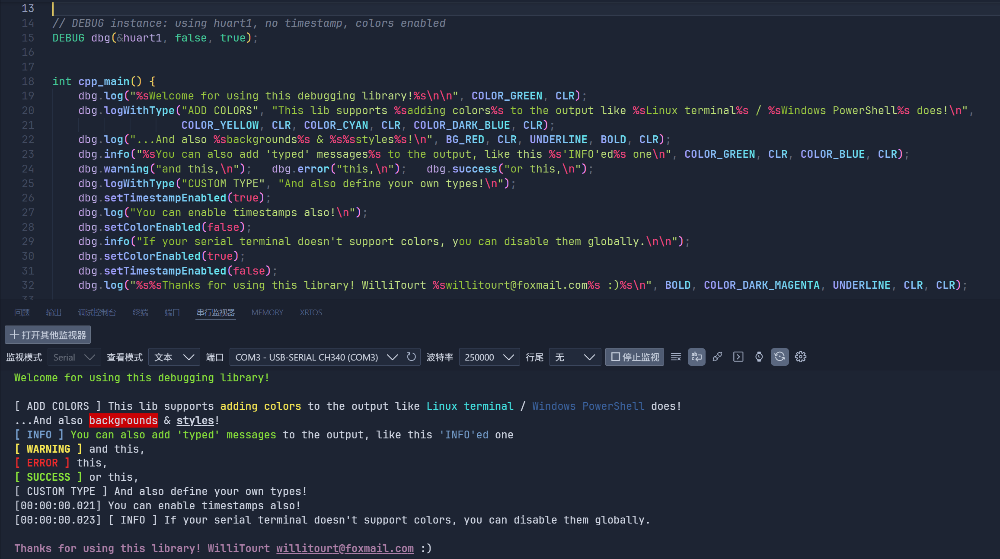
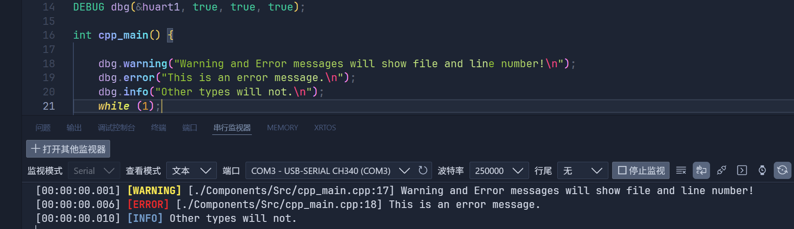
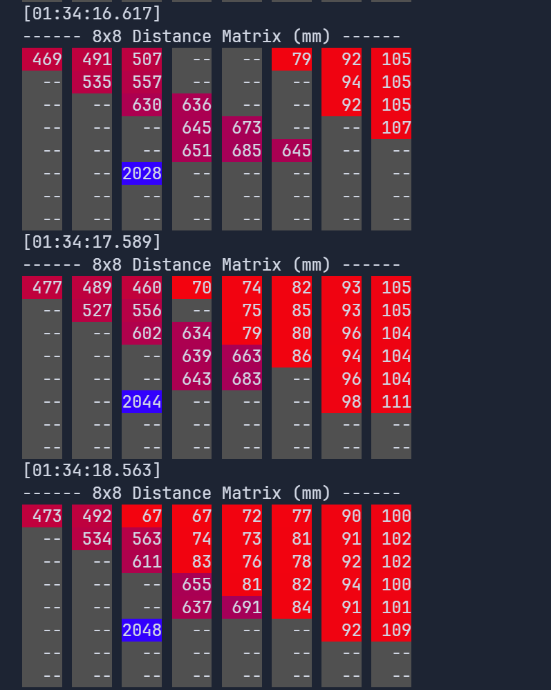
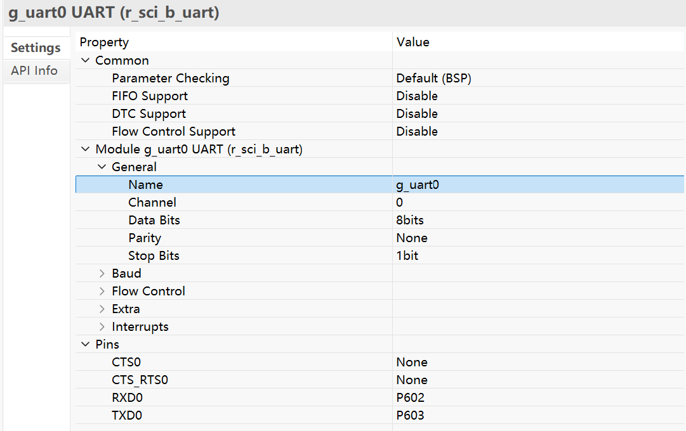
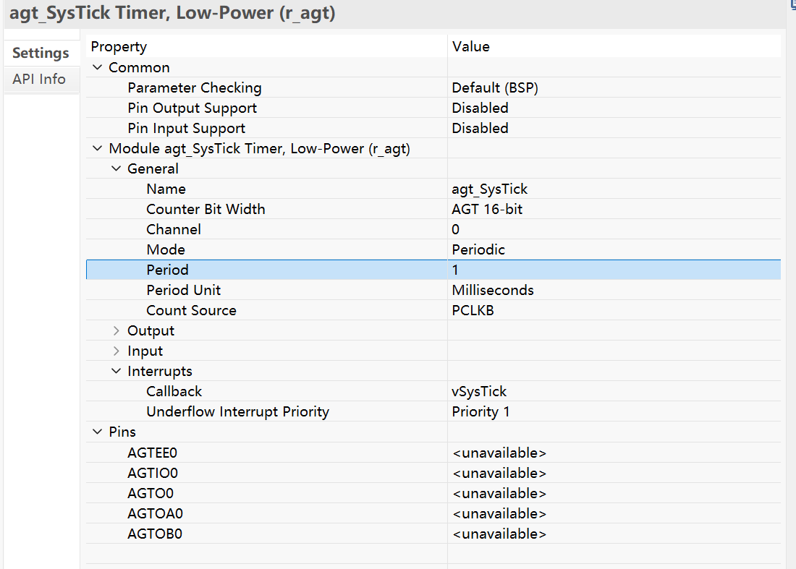

# Elegant Debug for STM32 & Renesas-RA MCUS

> **Language/语言**: [English](README.md) | [简体中文](README-zh-CN.md)

## 简介

- 这是一个轻量的 串口/USB-CDC 调试库，C / C++ 均适用，适配STM32 HAL库以及瑞萨RA FSP，提供格式化日志输出功能。
- 特点：
  - 格式化日志
  - 可选的时间戳
  - 可选的 ERROR/WARNING 信息 显示报错文件名和行号
  - 可选的 ANSI 颜色输出，包括完全自定义的24位颜色
  - 便捷的类型前缀（ERROR/WARNING/INFO/OK/SUCCESS）



支持错误信息文件名行号输出：


支持自定义颜色输出：


## 文件结构（仓库）

- C 版本放在 `Src-C/`
- 另有 C++ 版本放在 `Src-CPP/`

## 快速开始

- 依赖 STM32Cube HAL 驱动 / Renesas RA FSP，必须启用一个串口，或者启用USB-CDC（USB模式当前仅在STM32上有效。在MX配置中打开USB_DEVICE中间件，设置为CDC类即可）
- 输出长度由 `DEBUG_BUFFER_LEN` 宏控制（默认 256）
- 输出方式（串口/USB）由 `USB_AS_DEBUG_PORT` 宏控制（默认0，使用串口；设置为1使用USB-CDC）
- ⚠️ **使用前必须选择平台**：在 include 之前，取消注释头文件中 `USE_STM32_HAL` 或 `USE_RA_FSP` 其中一个宏

### STM32 HAL 平台

1. 将 `Src-C/ElegantDebug.h` 与 `Src-C/ElegantDebug.c` 添加到你的工程（确保 `ElegantDebug.c` 被编译并加入链接）。
   - Makefile/CMake：将 `.../Src-C/ElegantDebug.c` 加入 `SRCS` / `target_sources`。
   - Keil/MDK / IAR / CubeIDE：在 Project Explorer 中 Right-click -> Add Existing Files。

2. 在你的代码中包含头文件并初始化（以 `huart1` ，C语言版本为例，C++版本用法完全一致）：

```c
#define USE_STM32_HAL
#include "ElegantDebug.h"

// 在合适的位置（比如 main() 里）初始化
// 如果 USB-CDC 被设置为调试端口（编译时宏 `USB_AS_DEBUG_PORT` 为 1），`huart` 参数可以传 NULL，库会忽略它。
debug_init(&huart1, true /* enable timestamp */, true /* enable color */, false /* enable filename line */);
```

### Renesas RA FSP 平台

1. 同样将 `Src-C/ElegantDebug.h` 与 `Src-C/ElegantDebug.c` 添加到你的瑞萨工程。

2. 在 RASC 中配置一个 **SCI UART** 外设（随便哪个SCI通道）。


3. 初始化并使用（这里以 cpp 版本 `g_uart0` 为例）：

```cpp
#include "ElegantDebug.h"

// 全局 debug 实例
ElegantDebug dbg(&g_uart0, true, true, false);

void cpp_main() {
    // ...

    dbg.info("Hello from Renesas RA!");
    dbg.ok("ElegantDebug logging");

    // ...
}
```

4. **时间戳喂入**（重要）：由于瑞萨没有像STM32一样的`GetTick()`，库需要你创建一个**1ms**计数器来生成时间戳，你需要从定时器回调中调用 `debug_tick()`（C版本）/`ElegantDebug::tick()`（CPP版本） 来递增这个计数器。例如配置一个AGT：


```c
// 在你的 1ms 定时器 ISR 中：
void vSysTick(void) {
    debug_tick(); // 喂入 ElegantDebug 时间戳
}
```

C++ 版本使用 `ElegantDebug::tick()` 替代。

### 共用示例

```c
debug_log("Hello world！");
debug_info("System started. Free memory: %d bytes", free_mem);
debug_warning("Low battery: %.2f %%", battery_percentage);  // 自动包含文件名和行号（如果启用）
debug_error("Sensor failed: code = %d", err_code);          // 自动包含文件名和行号（如果启用）
debug_ok("Operation finished in %d ms", elapsed_ms);
debug_success("Configuration saved");
debug_logWithType("[CUSTOM]", "custom message: %s", "ok");

/* 颜色和文本样式 */
debug_log("%sI am GREEN!%s\n", COLOR_GREEN, CLR);
debug_log("%sI have a colored background!%s\n", BG_RED, CLR);
debug_log("%sI am underlined and %spartly colored!%s%s\n", UNDERLINE, COLOR_DARK_MAGENTA, CLR, CLR);

/* 启用 ERROR / WARNING 信息的文件名和行号显示 */
debug_setFilenameLineEnabled(true);  // 启用后，error和warning信息将显示文件名和行号
```

## API

### C 版本

- `void debug_init(UART_HandleTypeDef *huart, bool enable_timestamp, bool enable_color, bool enable_filename_line);`（STM32）
- `void debug_init(uart_instance_t const *uart, bool enable_timestamp, bool enable_color, bool enable_filename_line);`（Renesas RA）
  - 初始化库，必须先调用，传入 HAL UART 句柄 或 FSP UART 实例 和是否启用时间戳/颜色/文件名行号显示。
- `static inline void debug_tick(void);`（仅 RA FSP）
  - 定时器 ISR 中调用以递增内部毫秒计数器，用于时间戳功能。
- `void debug_log(const char* format, ...);`
  - 原始格式化输出（无前缀）。
- `void debug_logWithType(const char* type, const char* style, const char* format, ...);`
  - 自定义前缀和样式的输出（例如 `"\033[91m"` + `"[ CUSTOM ]"`）。
- 便捷类型输出（自动包含文件名和行号）：
  - `void debug_error(const char* format, ...);`
  - `void debug_warning(const char* format, ...);`
- 便捷类型输出（无文件名行号）：
  - `void debug_ok(const char* format, ...);`
  - `void debug_success(const char* format, ...);`
  - `void debug_info(const char* format, ...);`
- 运行时设置：
  - `void debug_setTimestampEnabled(bool enabled);`
  - `void debug_setColorEnabled(bool enabled);`
  - `void debug_setFilenameLineEnabled(bool enabled);`

### C++ 版本

- `ElegantDebug(UART_HandleTypeDef *huart, bool enable_timestamp = true, bool enable_color = true, bool enable_filename_line = false);`（STM32）
- `ElegantDebug(uart_instance_t const *uart, bool enable_timestamp = true, bool enable_color = true, bool enable_filename_line = false);`（Renesas RA）
  - 构造函数，传入 HAL UART 句柄 或 FSP UART 实例 和是否启用时间戳/颜色/文件名行号显示。
- `static inline void tick(void);`（仅 RA FSP）
  - 类静态方法，从定时器 ISR 中调用以递增内部毫秒计数器，用于时间戳功能。
- `void log(const char* format, ...);`
  - 原始格式化输出（无前缀）。
- `void logWithType(const char* type, const char* style, const char* format, ...);`
  - 自定义前缀和样式的输出（例如 `"\033[91m"` + `"[ CUSTOM ]"`）。
- 便捷类型输出（C++20及以上版本自动包含文件名和行号）：
  - `void error(const char* format, ...);` (C++20: 支持 `std::source_location`)
  - `void warning(const char* format, ...);` (C++20: 支持 `std::source_location`)
- 便捷类型输出（无文件名行号）：
  - `void ok(const char* format, ...);`
  - `void success(const char* format, ...);`
  - `void info(const char* format, ...);`
- 运行时设置：
  - `void setTimestampEnabled(bool enabled);`
  - `void setColorEnabled(bool enabled);`
  - `void setFilenameLineEnabled(bool enabled);` (仅C++20及以上版本)

#### 需要注意

- `error` 和 `warning` 函数**不能使用可变参数**，因为它们需要获取调用位置（文件名和行号）。

```cpp
	dbg.error("error test... %d\n", 12345); // 不对的用法
	dbg.error("%serror test...\n", BOLD);   // 不对的用法
	dbg.error("error test... \n");          // 对的用法

// 前两行代码由于默认参数和可变参数混合时，参数匹配问题导致编译报错
```

### 关于ANSI转义码

库中的颜色和样式宏均为 ANSI 转义码，如果终端不支持，可以通过运行时设置关闭颜色输出，并停用%s修饰的操作。

要为你的输出字符串设置自定义颜色和样式，请用一对 `%s` 来包裹颜色/样式宏和用以清除颜色/样式的宏。例如：

```cpp
log("Hello World! %sI am RED!%s %s%sI am italic and GREEN!%s Now i cleared italic style but still GREEN.%s\n", 
COLOR_RED, CLR_TEXT_COLOR, ITALIC, COLOR_GREEN, CLR_ITALIC, CLR);
```

对于24位自定义颜色，请使用 `COLOR_CUSTOM(r,g,b)` 和 `BG_COLOR_CUSTOM(r,g,b)` 宏，其中 `r`、`g`、`b` 为0~255之间的整数。这些宏现在内部调用了运行时辅助函数，因此可以使用变量而非字面常量传递颜色值。

关于 ANSI 转义码的更多信息，请参考：[ANSI escape code - Handwiki](https://handwiki.org/wiki/ANSI_escape_code)

## 常见问题与排查

- 串口无输出或者一坨乱码：
  - 确认串口已正确初始化（**特别是波特率**）。
  - 如果启用颜色但终端不支持 ANSI，可以通过 `debug_setColorEnabled(false)` 关闭颜色。
- RA 平台时间戳不工作或显示为 `[00:00:00.000]`：
  - 确认已在你的 1ms 定时器 ISR 中调用前文所述 tick。
- 异常重启
  - 可能是字符串溢出，检查`DEBUG_BUFFER_LEN`缓冲区长度（默认 256）。如需更长信息，在 `ElegantDebug.h` 中调整此宏（注意内存占用）

## 更新日志

### v1.0 (2025-12-10)

- **初始发布**: STM32 Elegant Debug 库首次发布
- **功能**: 格式化日志输出、时间戳、ANSI颜色、类型前缀等基础功能
- **支持**: C和C++双版本，适配STM32 HAL库

### v1.1 (2025-12-11)

- **新增**: 支持在错误和警告信息中显示文件名和行号
  - C版本：通过 `debug_setFilenameLineEnabled(true)` 启用，`debug_error()` 和 `debug_warning()` 自动包含文件名行号
  - C++版本（C++20及以上）：通过 `setFilenameLineEnabled(true)` 启用，支持 `std::source_location`
- **新增**: 支持更多的ANSI颜色和样式
- **改进**: 更新API文档，更准确地反映实际功能

### v1.2 (2026-02-22)

- **新增**: 此库现在支持USB-CDC输出。要使用此功能，只需打开MX配置中的USB_DEVICE中间件，将USB设置为CDC类。然后在此库头文件中将 `USB_AS_DEBUG_PORT` 定义为 `1` 即可。

### v1.3 (2026-03-01)

- **改进**: 现在自定义颜色可以传入运行时变量。这支持了更多样的用法，例如根据数字大小设置对应的渐变颜色（如简介处图）

### v1.4 (2026-07-16)

- **新增**: 支持 Renesas RA FSP 平台（`USE_RA_FSP` 宏）
  - SCI UART 输出
  - 独立的时间戳计数器 `_debug_tick_ms`，用户从定时器 ISR 喂入 C 版本 `debug_tick()` / C++ 版本 `ElegantDebug::tick()` 内联函数
- **新增**: 平台选择机制（`#if defined(USE_STM32_HAL)` / `#elif defined(USE_RA_FSP)`）条件编译

## 其他

> 此库灵感最初源于学长Zodiak_Jealously的提议 ;p

WilliTourt 2025.12.10 initial release | willitourt@foxmail.com

欢迎提交 PR 和 Issue！！
