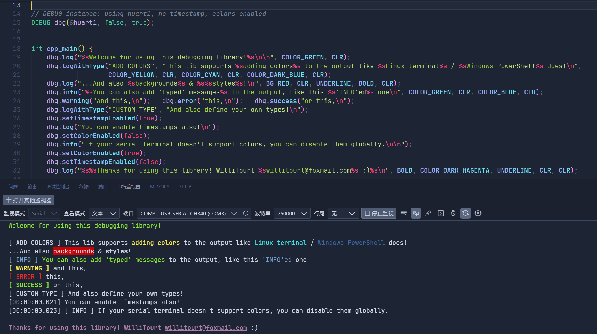
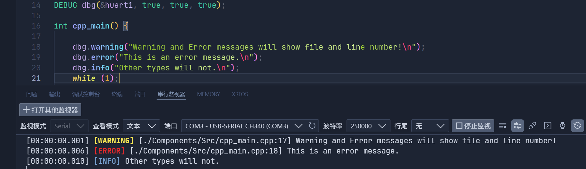

# STM32 Elegant Debug

> **Language/语言**: [English](README.md) | [简体中文](README-zh-CN.md)

## Introduction
- A lightweight serial debug library suitable for both C and C++ projects on STM32 using the HAL drivers.
- Features: 
  - Formatted output
  - Optional timestamp
  - Ooptional filename and line number display for ERROR/WARNING messages
  - Optional ANSI color output
  - Convenient type prefixes (ERROR/WARNING/INFO/OK/SUCCESS)




## Repository layout
- C implementation is in `Src-C/`
- C++ implementation is in `Src-CPP/`

## Quick Start
- Depends on STM32Cube HAL and at least one UART enabled.
- The output buffer length is controlled by the `DEBUG_BUFFER_LEN` macro (default 256).

1. Add `Src-C/debug.h` and `Src-C/debug.c` to your project (make sure `debug.c` is compiled and linked).
   - Makefile/CMake: add `.../Src-C/debug.c` to your `SRCS` / `target_sources`.
   - Keil/MDK / IAR / CubeIDE: in the Project Explorer, Right-click -> Add Existing Files.

2. Include the header and initialize (example using `huart1`, C API shown; C++ usage is identical):
```c
#include "debug.h"

/* Initialize at an appropriate place (e.g. in main()) */
debug_init(&huart1, true /* enable timestamp */, true /* enable color */, false /* enable filename line */);

/* Usage examples */
debug_log("Hello world!");
debug_info("System started. Free memory: %d bytes", free_mem);
debug_warning("Low battery: %.2f %%", battery_percentage);  // Automatically includes filename and line number (if enabled)
debug_error("Sensor failed: code = %d", err_code);          // Automatically includes filename and line number (if enabled)
debug_ok("Operation finished in %d ms", elapsed_ms);
debug_success("Configuration saved");
debug_logWithType("[CUSTOM]", "custom message: %s", "ok");

/* Colors and styles */
debug_log("%sI am GREEN!%s\n", COLOR_GREEN, CLR);
debug_log("%sI have a colored background!%s\n", BG_RED, CLR);
debug_log("%sI am underlined and %spartly colored!%s%s\n", UNDERLINE, COLOR_DARK_MAGENTA, CLR, CLR);

/* Enable filename and line number display (optional) */
debug_setFilenameLineEnabled(true);  // After enabling, error and warning messages will show filename and line number
```

## API
### C API
- `void debug_init(UART_HandleTypeDef *huart, bool enable_timestamp, bool enable_color, bool enable_filename_line);`
  - Initialize the library. Must be called before other functions. Provide a HAL UART handle and flags to enable timestamp/color/filename-line display.
- `void debug_log(const char* format, ...);`
  - Basic formatted output (no prefix).
- `void debug_logWithType(const char* type, const char* format, ...);`
  - Output with a custom type prefix (e.g. `"[ CUSTOM ]"`).
- Convenience helpers (automatically include filename and line number):
  - `void debug_error(const char* format, ...);`
  - `void debug_warning(const char* format, ...);`
- Convenience helpers (no filename/line):
  - `void debug_ok(const char* format, ...);`
  - `void debug_success(const char* format, ...);`
  - `void debug_info(const char* format, ...);`
- Runtime setters:
  - `void debug_setTimestampEnabled(bool enabled);`
  - `void debug_setColorEnabled(bool enabled);`
  - `void debug_setFilenameLineEnabled(bool enabled);`

### C++ API
- `DEBUG(UART_HandleTypeDef *huart, bool enable_timestamp = true, bool enable_color = true, bool enable_filename_line = false);`
  - Constructor: pass a HAL UART handle and flags to enable timestamp/color/filename-line display.
- `void log(const char* format, ...);`
- `void logWithType(const char* type, const char* format, ...);`
- Convenience helpers (C++20 and above automatically include filename and line number):
  - `void error(const char* format, ...);` (C++20: supports `std::source_location`)
  - `void warning(const char* format, ...);` (C++20: supports `std::source_location`)
- Convenience helpers (no filename/line):
  - `void ok(const char* format, ...);`
  - `void success(const char* format, ...);`
  - `void info(const char* format, ...);`
- Runtime setters:
  - `void setTimestampEnabled(bool enabled);`
  - `void setColorEnabled(bool enabled);`
  - `void setFilenameLineEnabled(bool enabled);` (C++20 and above only)

## Troubleshooting
- Linker errors (undefined reference to `debug_init` / `debug_info`):
  - Ensure `Src-C/debug.c` is added to the project and compiled into an object file that is linked into your final binary.
- No output or garbled output on the serial terminal:
  - Verify `huart` is correctly initialized (especially baud rate).
  - If colors are enabled but your terminal does not support ANSI, call `debug_setColorEnabled(false)`.
- Unexpected resets/crashes:
  - Possible buffer overflow: check `DEBUG_BUFFER_LEN` (default 256). Increase it in `debug.h` if you need longer messages (mind RAM usage).

## Changelog

### v1.1.0 (2025-12-11)
- **New**: Support for displaying filename and line number in error and warning messages
  - C version: Enable with `debug_setFilenameLineEnabled(true)`, `debug_error()` and `debug_warning()` automatically include filename and line number
  - C++ version (C++20 and above): Enable with `setFilenameLineEnabled(true)`, supports `std::source_location`
- **Improvement**: Updated API documentation to accurately reflect actual functionality

### v1.0.0 (2025-12-10)
- **Initial release**: First release of STM32 Elegant Debug library
- **Features**: Formatted log output, timestamp, ANSI colors, type prefixes and other basic functionality
- **Support**: Dual C and C++ versions, compatible with STM32 HAL library

## License
- See the `LICENSE` file at the repository root for licensing details.

## Other

This project was inspired by a suggestion from Zodiak_Jealously ;p

WilliTourt 2025.12.10 initial release | willitourt@doxmail.com

Contributions and PRs welcome!
